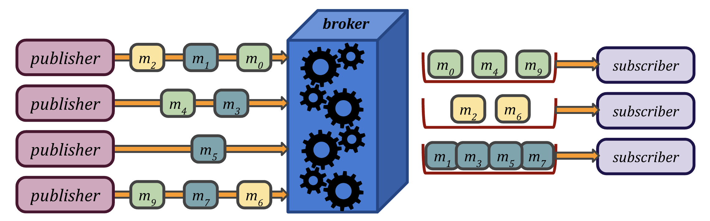
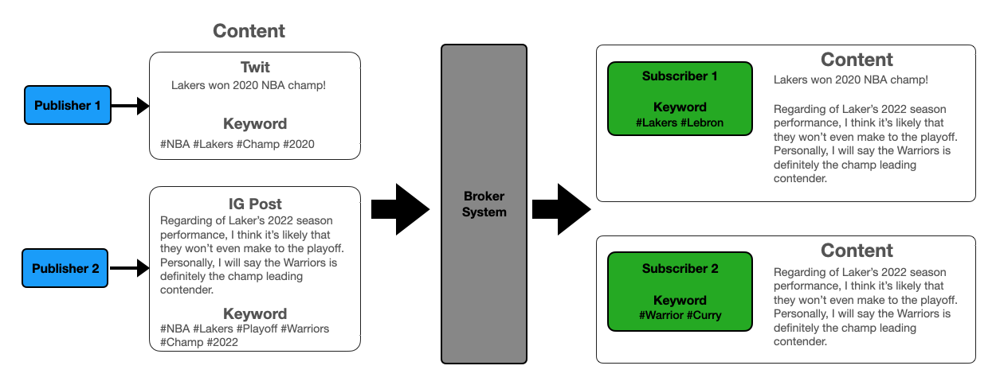
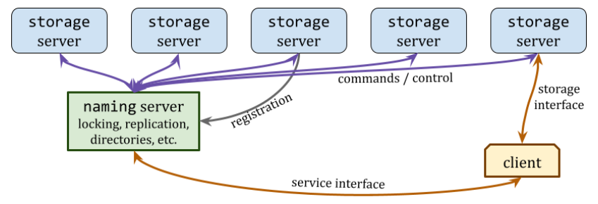
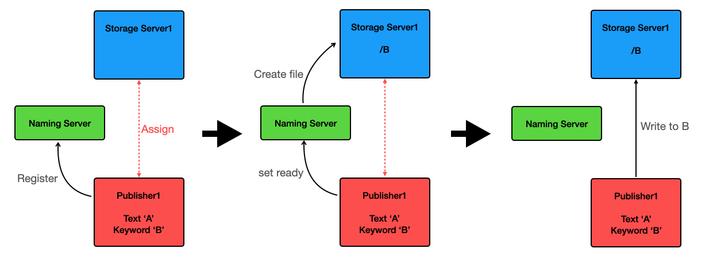
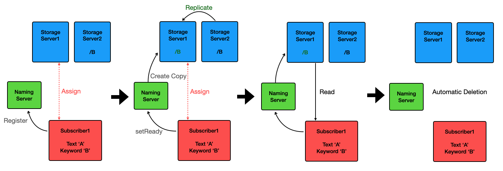

# Lab4: Publish-Subscribe Platform
**Member**: Sheng-Hao Wu(shengha2), Kevin Li(kli4)  

------
## Preface
After finished Lab3 (DFS), Kevin and I gained a deep interest in developing distributed, tree-structural file
system. As in Lab4 option1: "Public-Subscribe Platform", since it's mainly based on the Lab3 DFS system and 
add on publishing and subscription features, it's an opportunity for us to enhance our skills we 
learned in Lab3, and to take it to another level.

## Lab Summary
In this project, we will implement a simple text publish-subscribe platform, based on the concept of (DFS) 
distributed file system. Original DFS, or so called broker in Pub-Sub system, serves as an intermediate layer 
that handle input from publisher, and provides matched contents to subscribers. '

The two main clients, are 
publisher and subscriber. Publishers are the content producer that stream content into system. In our design, 
our content are mainly text, like an one-line twit from Twitter, or a post from Instagram (without photo), which is 
expected to have more words. Each of text content can have multiple keywords. Subscriber, on the 
other hand, are content consumer, that they can subscribe the content based on their keyword 
preference. Following image illustrate the publisher and subscriber behaviors.  

### DFS Background
The distributed File System (DFS) in this lab is inherited from the one we designed in Lab3. The DFS comprises 
one naming server, and maybe few storage servers that store the files. This DFS also serve as broker system, 
that publisher and subscriber always first to interact with naming server, then once they are registered and 
assigned to one specific storage server, it's allowed to interact with that storage server directly.    

In the original DFS, RESTful APIs are already supported as following list. These APIs will be heavily used in our implemenation
for the Pub-Sub system.

#### Naming Server
* Registration: `/register`
* Service: `/is_valid_path`, `/getstorage`, `/delete`, `/create_directory`, `/create_file`, `/list`, `/is_directory`, `/lock`, `/unlock`
* Service (**New API**): `/publisher_register`, `subscriber_register`, `replication`
#### Storage Server:
* Command: `/storage_create`, `/storage_delete`, `/storage_copy`
* Storage: `/storage_size`, `/storage_read`, `/storage_write` 

**Note**: 
1. For more details about DFS, please refer to Lab3 handout. 
2. Newly implemented API in Lab4 is also included in the API document

### Publisher
The publisher is one kind of client that provide content to the system. Registration is required including assignment 
to single storage server to write to. After that, ingest content to assigned server that each item (twit, IG post) will
be labeled with a list of keywords. Replications are needed with a reasonable consistency (discussed in subscriber section).
#### Implementation
For registration `Publisher.register()`, publisher will ask naming server to provide the most free storage server (with the least publishers 
assigned to) for assignment. Once it's assigned, publisher is allowed to directly interact with storage server and 
write stream content to it. 

The content will include two field: data and keywords, a java class: `content.java` help format the content. Since 
it's likely that there are several content in stream, to be realistic we apply queue the FIFO structure storing these 
content for the storage server to process.

In each storage server, they all start with root director `/`. For each keyword, it creates a one level of directory (a file).
Since keyword is supposed to be unique, so we expect that the path length will no longer exceed one level depth. Once a publisher 
has content to publish, it will first send the keywords information to the naming server and naming server will create the 
corresponding empty file named as the keyword (`Publisher.setReady()`). Later, publisher can directly talk to storage server and write that file
under the keyword directory(`Publisher.publish()`).

Regarding replication, we keep it simple that only when one storage server lack a certain but existed in other server, then
we copy file. We will talk more in the subscriber section.

Here is a simple publisher scenario
* Publisher1 register a storage server1
  * API: **service**:`/publisher_register`(new API)
  * Method: `Publisher.register()`
* Publisher1 has content (text`A`/keyword`B`)
* It first notifies naming server to and create (if not existed) file `/B` on the storage server1.
  * API: **service**: `/create_file`  **command**: `/storage_create`
  * Method: `Publisher.setReady()`
* Publisher1 write content `A` into file `/B`
  * API: **client**: `/write`
  * Method: `Publisher.publish()`

  
### Subscriber
The subscriber is one kind of client that consume the content which it prefers to based on the keywords. 
Registration is required including assignment to single storage server to read from. If file doesn't exist on assigned
server but on the other, replication will be required. Lastly, automatic deletion of content after all registered
subscribers read it.

#### Implementation
For registration`Subscriber.register()` ,  subscriber will ask naming server to provide the most free storage server 
(with the least subscriber assigned to) for assignment. Once it's assigned, subscriber is allowed to directly interact 
with storage server and read stream content from it. After that, subscriber will let naming server do the replicate check `Subscriber.setReady()`, 
which means if the content subscriber subscribe on only exist on other server but not the assigned one, then naming server will copy file 
from that server to the assigned one.

Once the assigned server has the files ready (may not have all ready because some may just doesn't exist in the entire 
system), subscriber will start read the content `Subscriber.readContent()`. It first lock on that file via naming server, directly reading from storage server, then finally unlock
. When sending lock to naming server, naming server also take care that how many reads has been conductd by all these
registered subscriber. If a content is read by all subscriber, then naming server will delete that content on all 
storage servers during unlock stage.

Here is a simple subscriber scenario
* Assume storage server1 is empty, server2 has content (text`A`/keyword`B`) 
* Subscriber1(keyword`B`) register storage server1 
  * API: **service**:`/subscriber_register`
  * Method: `Subscriber.register()`
* Subscriber1 has keyword`B`, here is the replication, that it first notifies naming server and copy (if exist on other server) file `/B` from the storage serverY.
  * API: **service**: `/replication` (new API)  **command**: `/storage_copy` **client**: `/storage_read`,`/storage_write`
  * Method: `Subscriber.setReady()`
* Subscriber lock the file before read via naming server
  * API: **service**: `/lock`
  * Method: `Subscriber.readContent()`
* Subscriber read file directly from storage server
  * API: **storage**: `/read`
  * Method: `Subscriber.readContent()`
* Subscriber unlock the file after read via naming server, here do the automatically deletioin
  * API: **service**: `/unlock`, `/delete` **command**: `/storage_delete`
  * Method: `Subscriber.readContent()`

## Test
In the above section we describe both the publisher and subscriber scenario, and our testcases are exactly based on 
these scenarios, targeting each step one-by-one gradually. First the publisher is verified in first three testcases, 
then 4th to 7th are for subscriber. Total seven testcases are designed, and they cover all the essential functions 
that publisher / subscriber should have, and they are all implement in file: `ConformanceTest.java`
### Environment
Our team apply JUnit testing and maven framework for this project. JUnit can generate testing coverage, ensuring that 
every single part of function in software is tested before module or system level testing is performed. Maven, is known 
for helping manage dependencies in files and libraries, and it integrates with JUnit easily simply by modifying the 
`pom.xml`.  

Since the in-built test command `mvn test` will only run once, we design a simple short test script in python3 that we 
can individually target each testcase to let it run multiple times as we defined. Overall it's still based on maven test
architecture, the script basically is like a customized makefile that running in-built `mvn test` command. 
#### Test Instruction
Pre-Requiste: Java17, Maven, JUnit5, Python3, IntelliJ (highly recommend)

It's highly recommend (but not mandatory) to use IntelliJ as IDE to run our testcase. Before run, make sure
that the JUnit5 and Maven is properly installed. Once the software is set, use our provided python3 test script with command
as followed. The argument `repeated_times` can be customized set up to tester preferance.
>python3 stressTest.py <repeated_times>

### setUp
Before any testcase running, initialize the naming server and storage server parameters properly since it's the foundation
for broker system. 

---
#### PubRegistrationTest
This test is to verify that system can correctly assign the storage server to publisher.  

* Test with no storage server
  * Init Publisher1 and send `/publisher_register` and `/FileNotFoundException` exception is expected
* Init two storage server and one publisher
  * PublisherA send `/publisher_register` and check response server info that is valid or not
* Add one publisher2
  * PublisherB send `/publisher_register` and check response server info that should be different from PublisherA's
---
#### PubSetReadyTest
This test is to let naming server set file ready for publisher before publishing  
`Prerequisite: PubRegistrationTest`
* Init two storage server1, storage server2 and make one publisher registered assigned to storage server1
* Set publisher content as Content(Text`Lakers won 2020 NBA Champ!`/Keywords`NBA`, `Lakers`, `Champ`, `2020`)
* Publisher `setReady()` should create file (`/create_file`) on storage server1, verified with `/storage_read` without exception
---
#### PubPublishTest
This test is to test if publisher can successfully publish content to storage server  
`Prerequisite: PubRegistrationTest, PubSetReadyTest`
* Init two storage server1, storage server2 and make one publisher registered assigned to storage server1
* Set publisher content as Content (Text:`I like NBA Lakers!`/Keyword`NBA`, `Lakers`) and set ready for the system
* Publisher send `/storage_write` and write content `A`
* Send `/storage_read` to serverX, should read the same content as `I like NBA Lakers!`
----
#### SubRegistrationTest
This test is to verify that system can correctly assign the storage server to subscriber

* Test with no storage server
  * Init subscriber1 and send `/subscriber_register` and `/FileNotFoundException` exception is expected
* Init two storage server and one subscriber with no keyword
  * Subscriber1 send `/subscriber_register` and check response server info that is valid or not
* Add one subscriberB with no keyword
  * Subscriber2 send `/subscriber_register` and check response server info that should be different from subscriber1's
----
#### SubReplicationTest
This test is to let naming server set file ready (replicate if it exist in other storage server) for subscriber before reading content    
`Prerequisite: SubRegistrationTest`
* Init two storage server1, storage server2 with content(Content`I like NBA Warriors!`/keyword`NBA`, `Warriors`) and make one subscriber1 registered to storage server1
* Set subscriber1 keyword `NBA`, `Lakers`
* Subscriber `setReady()`, should properly do the replication process that copy file from storage server2 to storage server1
* verified with `/storage_read` without exception
----
#### SubReadTest
This test is to verify subscriber can read content from assigned server if it has subscribed contents   
`Prerequisite: SubReplicationTest`
* Init two storage server1, storage server2 with content(Content`I like NBA Warriors!`/keyword`NBA`, `Warriors`) and make one subscriber1 registered to storage server1
* Set subscriber1 keyword `NBA`, `Lakers`
* Subscriber `setReady()` to replicated if needed
* Subscriber `readContent()`, the return content should be like {`NBA`:`I like NBA Warriors`, `Lakers`:null}, like keyword `NBA` should have matched text
----
#### SubDeletionTest
This test is test system will automatically delete content if it has been read by all subscribers   
`Prerequisite: SubRegistrationTest`
* Init two storage server1 with content (Text:`I like NBA Warriors`/keyword`NBA`), storage server2 with content1( Text:`I like NBA Warriors`/keyword:`NBA`), content2( Text:`I like NBA Warriors`/keyword:`Warriors`)
* Init subscriber1 with keyword`NBA`, keyword`Lakers`, and it's registered to storage server1
* Init subscriber2 with keyword`NBA`, `Warriors`, and it's registered to storage server2
* Subscriber1 `readContent()`, then check that all files on both storage server should be remained
* Subscriber2 `readContent()`, then check that all files on both storage server should be deleted
